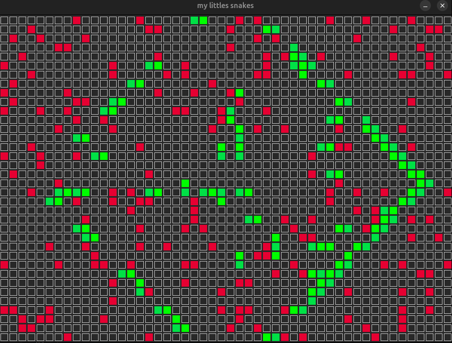
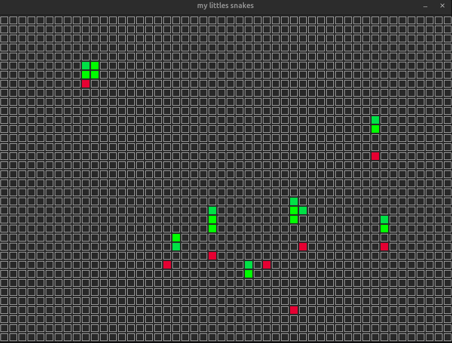
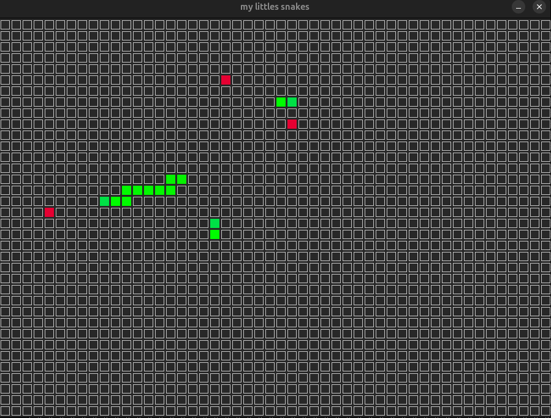
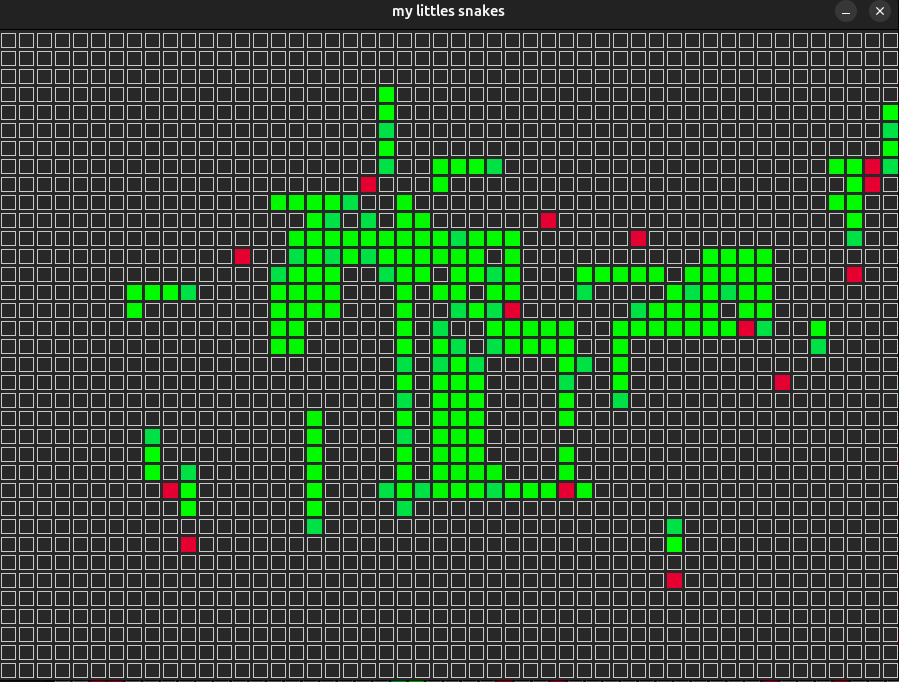
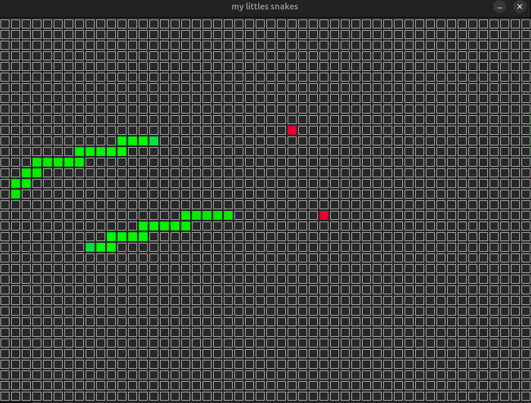

# SnakeGame-AI

<div align="center" style="display:flex; justify-content:center; gap:12px; flex-wrap:wrap;">
  
  
  
  
  
</div>

A C++ project to train neural networks using a genetic algorithm in the Snake game.

## Dependencies

This project requires the following dependencies:

- **SDL2** - Graphics/windowing library
- **Eigen3** - Linear algebra library
- **g++** - C++ compiler
- **make** - Build tool

## Installation Instructions

### Linux (Ubuntu/Debian)

```bash
# Update package manager
sudo apt update

# Install build essentials and dependencies
sudo apt install -y \
  build-essential \
  g++ \
  make \
  libsdl2-dev \
  libeigen3-dev
```

### macOS

```bash
# Install Homebrew if not already installed
/bin/bash -c "$(curl -fsSL https://raw.githubusercontent.com/Homebrew/install/HEAD/install.sh)"

# Install dependencies
brew install sdl2 eigen
```

### Windows

#### Option 1: Using MinGW and vcpkg (Recommended)

```bash
# Install MSVC or MinGW-w64 compiler
# Download from: https://www.mingw-w64.org/

# Install vcpkg for dependency management
git clone https://github.com/Microsoft/vcpkg.git
cd vcpkg
./bootstrap-vcpkg.bat

# Install dependencies
./vcpkg install sdl2:x64-windows
./vcpkg install eigen3:x64-windows

# Integrate vcpkg with your environment
./vcpkg integrate install
```

#### Option 2: Manual Installation

1. **SDL2**: Download from https://github.com/libsdl-org/SDL/releases
2. **Eigen3**: Download from https://eigen.tuxfamily.org/
3. Set up environment variables and include paths for your compiler

## Building

### Linux/macOS

```bash

# Or run with training
make all

# Run the game
./bin/mainGame {number of snakes} {n of iterations (optional)} {mut factor (optional)} {max change (optional)}

# ex:
./bin/mainGame 300 50 0.2 0.5

#or make run game for default values
make run_training

# for playing with a trained brain, move the brain to the data/final folder and:
make game
./bin/play "path to the brain file"

```

### Windows

```bash
# Using MinGW (adjust compiler flags as needed)
g++ -o bin/mainGame.exe game/training.cpp src/*.cpp -lSDL2 -Wall -Werror -Wextra

# Run
./bin/mainGame.exe
```

## Project Structure

- `include/` - Header files (neural_network.hpp, SDLSnakeGameAi.hpp, snake.hpp)
- `src/` - Source implementations
- `game/` - Game logic and training loops
- `data/` - Training data and brain files
- `tests/` - Test files


## WIP! todo:

- make S actually skip the current iteration
- make timeout a parameter that's configurable
- maybe: implement a way to take screenshots of the game (maybe even record it)
- fix assertion inconsistencies (neural_network.hpp:85)
- document better
